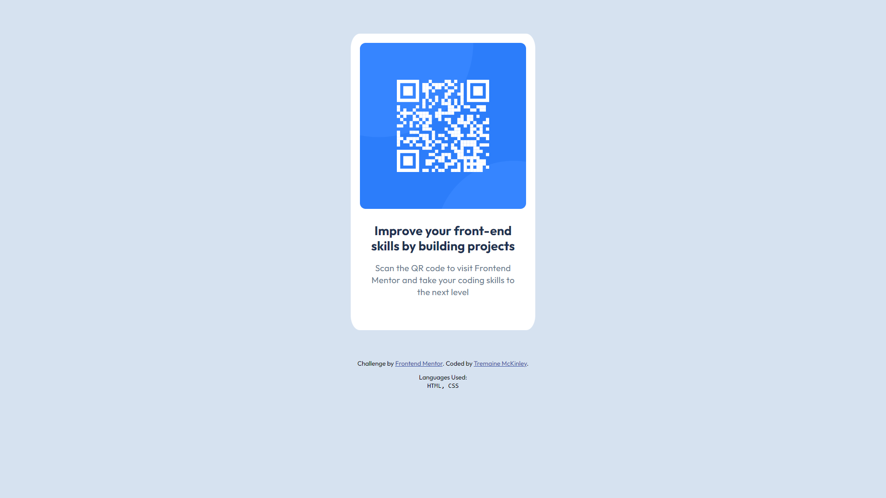

# Frontend Mentor - QR code component solution

This is a solution to the [QR code component challenge on Frontend Mentor](https://www.frontendmentor.io/challenges/qr-code-component-iux_sIO_H). Frontend Mentor challenges help you improve your coding skills by building realistic projects. 

## Table of contents

- [Overview](#overview)
  - [Screenshot](#screenshot)
  - [Links](#links)
- [My process](#my-process)
  - [Built with](#built-with)
  - [What I learned](#what-i-learned)
- [Author](#author)
- [Acknowledgments](#acknowledgments)

**Note: Delete this note and update the table of contents based on what sections you keep.**

## Overview

### Screenshot

### Links

- Live Site URL: [Add live site URL here](https://qr-card-fementor.vercel.app/)

## My process

### Built with

- Semantic HTML5 markup
- CSS custom properties
- Flexbox

### What I learned

This was a good opportunity to get back into project building and web development. Deploying the project and using Github again were my main goals. I am working my way up to developing my Frontend skills and want to begin showcasing that for accountability.

## Author

- Website - [Tremaine McKinley](https://www.linkedin.com/in/tremaine-mckinley)
- Frontend Mentor - [@tremckinley](https://www.frontendmentor.io/profile/tremckinley)

## Acknowledgments
Thanks to the #memtech community and Rob Crocker for introducing me to Frontend Mentor and encouraging me to sharpening my skills no matter what!
